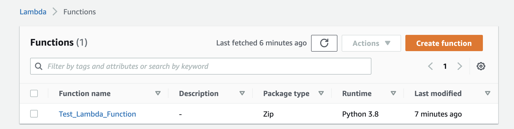
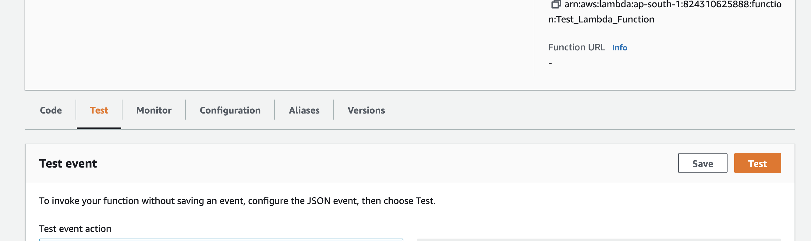
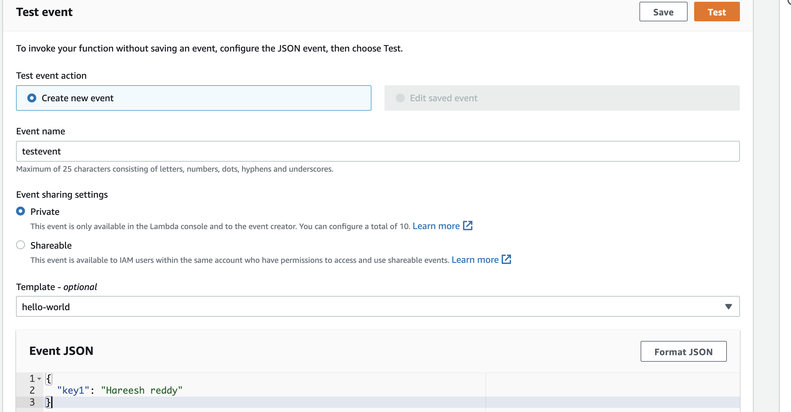
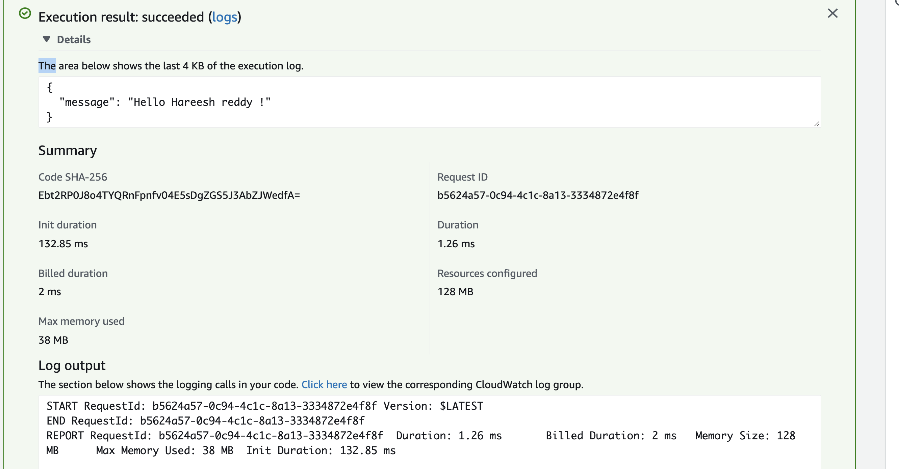

# creating aws lambda using terraform code


## Downloading the code

```
git clone https://github.com/purushothamkdr453/terraform-code.git
cd terraform-code/lambda
```

`terraform.tfvars` is the file which contains all the inputs required for terraform code. Update the values of these file as per your requirements. In this case I am creating an aws lambda function in ap-south-1 region(Mumbai)

**Note** Makesure you update the access key & secret key values prior running other commands.

# creating aws lambda using terraform

```
terraform init # this command is used to initialize the terraform aws provider
terraform apply -auto-approve # this command will create the lambda function
```

# Testing lambda function

To Test the Function Go to AWS Console.

Navigate to 

AWS -> Lambda -> Click "Funtions". 

you should see a function named "Test_Lambda_Function".



Click the function -> Select "Test"



Create the new event -> Provide the name for event for ex: testevent and enter eventdata json as follows.

```
{
  "key1": "Hareesh reddy"
}
```



Then click "Test".


